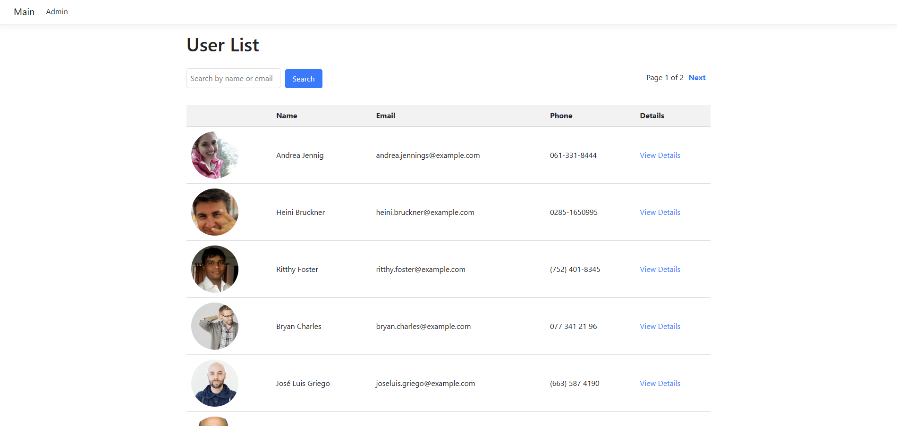

# Clermont WebApp

Just a basic webapp the grabs users from randomuser.me API saves them to a SQL db to which you can edit or delete them as well as read them from the main list.



## Table of Contents

- [Features](#features)
- [Technologies Used](#technologies-used)
- [Installation](#installation)
- [Database Configuration](#database-configuration)
- [Usage](#usage)
- [Contributing](#contributing)
- [License](#license)

## Features
- Edit and delete.
- User authentication with username and password.
- Search for users.

## Technologies Used

- **C#**: Programming language used for the backend.
- **ASP.NET Core**: Framework used for building the web application.
- **Entity Framework Core**: ORM for database operations.
- **SQL Server**: Database management system used.
- **Bootstrap**: Frontend framework for responsive design.
- **JavaScript**: For client-side functionality.

## Installation

1. Clone the repository:
   ```bash
   git clone git@github.com:austynwhaley/clermontSA2.git
2. Install the necessary NuGet packages:
   ```bash
   dotnet restore
3. Initilize appsettings.json file for db configurati:
    ```bash
   {
    "Logging": {
      "LogLevel": {
        "Default": "Information",
        "Microsoft.AspNetCore": "Warning"
      }
    },
    "AllowedHosts": "*"}
4. Connection String: In your appsettings.json file, add or modify the connection string to point to your SQL Server database:
   ```bash
   { "ConnectionStrings": 
   {"DefaultConnection": "Server=your_server_name;Database=your_database_name;User Id=your_username;Password=your_password;"}}

Replace your_server_name with the name of your SQL Server instance.

Replace your_database_name with the name of the database you want to use.

Replace your_username and your_password with your SQL Server credentials.


(Optionally you can insert your connection string manually in Program.cs at line 9 like this if there is trouble connecting)
```csharp
var connectionString = "Server=YOURCONNECTION;Database=YOURDB;Trusted_Connection=True;TrustServerCertificate=True;";
builder.Services.AddDbContext<ClermontDb>(options =>
    options.UseSqlServer(connectionString));
```


3. To set up migrations, use the following commands:
    ```bash
    dotnet ef migrations add InitialCreate
    dotnet ef database update

## Usage
Open your web browser and go to https://localhost:5001 (or the URL provided in your console).

Click on the "Admin" link to open the login modal.
Enter the username and password (use "admin" as the username and "password" as the password for testing).

Click the "Login" button to access the admin view.

## Contributing
Contributions are welcome! Please follow these steps:

Fork the repository.

Create a new branch: git checkout -b feature/YourFeature
Make your changes and commit them: git commit -m 'Add your feature'

Push to the branch: git push origin feature/YourFeature
Open a pull request.